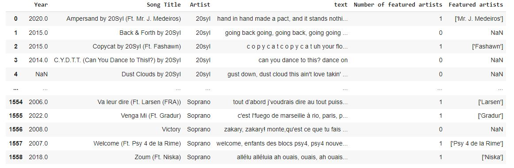
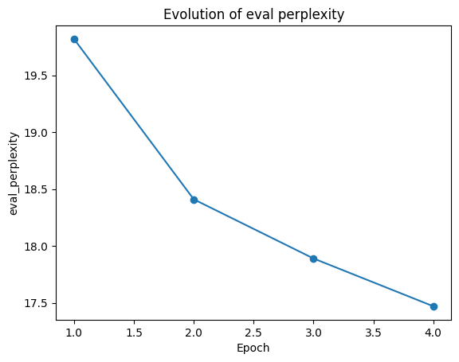
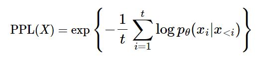
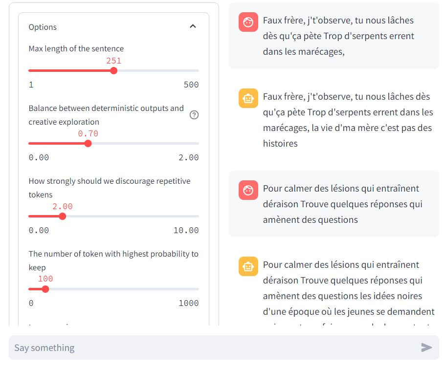

# Projet IA - Rap generation

Find all the model [here](https://drive.google.com/drive/folders/18p54luQeozrWoHVRGA3jLVdJEj2fo--p?usp=sharing)

## The project 

We are French rap fans, we have already worked on a project which consists in analyzing some statistics about rap songs. Now, we would like to create a **French rap song generator**.

To achieve this, we followed the advice provided [here](https://discuss.huggingface.co/t/fine-tune-gpt2-for-french-belgium-rap/7098).

## The dataset

In a previous project, we had already collected a large dataset (22,445 songs for 241 artists) about French rap. Therefore, we decided to use the same dataset to train our generator because it is composed of numerous artists.

For all the details regarding how we obtained the dataset and its description, please refer to [FrenchRapLyricsAnalyzer](https://github.com/MariusLD/FrenchRapLyricsAnalyzer)

In the folder [datacleaner](./datacleaner/) you should retrieve :
- original dataset
- a notebook to clean the data & split it into test and validation sets



## The generation

In the Hugging Face blog, it is stated that to fine-tune a pretrained GPT-2 model in French, one should use the **louis2020belgpt2** model from [github](https://github.com/antoiloui/belgpt2) or [huggingface](https://huggingface.co/antoinelouis/belgpt2)

- author = Louis, Antoine
- title = BelGPT-2: a GPT-2 model pre-trained on French corpora.
- year = 2020
 
To fine-tune on our dataset we use the script [run_clm_flax.py](https://github.com/huggingface/transformers/blob/main/examples/flax/language-modeling/run_clm_flax.py) that fine-tunes a generative model on some dataset. 

It was very challenging to use because there is no real documentation about how to use it. Thus, we had to read all the scripts to determine which parameters to use. For example, to fine-tune the model, the command is : 
 ```sh
 !python run_clm_flax.py --model_name_or_path antoiloui/belgpt2 --train_file train.csv --do_eval --validation_file validation.csv --output_dir output --do_train --preprocessing_num_workers 2 --num_train_epoch 1 --block_size=1024 --per_device_train_batch_size 4 --eval_steps 1000
 ```


First, the script loads the model to prepare it. Then, it loads the dataset and starts training on the training dataset. After that, you can define the `eval_step` for conducting evaluations, for example, every 1000 steps. The model is saved at each 500th step (which can be changed with `save_step`)


We completed 4 epochs (1 epoch = 1 h) to fine-tune our model (Google Colab crashed because the model is too big after 4 epochs). You can find all the models in the [model folder](./model/). However, it seems sufficient to have a great generator, as shown in this graph



A **low perplexity** is better, it means that the model is less surprised by a sample and could predict the next word with a better accuracy.



The perplexity use the cross entropy, it determines the probability that the 
i-th word is xi

## Graphic use 

We have created a graphical user-friendly interface, similar to ChatGPT. On the left side we have all the custom parameters of the model and, on the right side, the history of the generation. At the bottom there is the prompt field. The graphical interface was built using **Streamlit**.

You can find the notebook at [projetIA](./projetIA.ipynb).



## Result

It's hard to evaluate the efficiency of our model. Sometimes it generates very great outputs 

| prompt | output |
| ------ | -------|
|   j'peux t'péter ta tête     |j'peux t'péter ta tête si j'ai la folie  la balle est dans l'horizon, mais t'entends l'artiste qui passe  c'est d'la frappe atomique, j'ai la patate, gros j'te l'avais dit  un coup d'shit, j'fais l'tour de la planète  dans l'temps j'apprends que tout est noir, c'est pour ça qu'j'vais laisser l'shit sur l'complot  j'aime le shit, le biff, le biff, la street  des gros thunes, des grosses peines, de la pure |
| Faut jamais céder à la pression du groupe D't'façons, quand tu fais du mal, au fond, tu ressens du doute | Faut jamais céder à la pression du groupe D't'façons, quand tu fais du mal, au fond, tu ressens du doute les keufs ont mis les gants, ils veulent nous faire taire la main dans la poche, on veut le cash, on veut tout, la main dans la tienne on va tout t'péter, on va tout t'péter, j'suis le numéro deux j'te l'avais dit, t'avais pas les épaules, maintenant, t'as les épaules |
| Quelques rimes que tu peux comparer aux larmes du soleil Un jour de paix, tant qu'y'aura des hommes et des femmes qui s'aiment | Quelques rimes que tu peux comparer aux larmes du soleil Un jour de paix, tant qu'y'aura des hommes et des femmes qui s'aiment les mots qui tuent le plus, c'est ceux qui sont vrais la main dans la poche, on cherche le trésor de la chanson mais, dans l'hood on fait les choses à fond à fond, à fond, à fond, on va faire les choses à fond j'te l'avais dit, onn'tait plus rien à perdre on a grandi, on a grandi, on a grandi, on a grandi on est des hommes |

and sometimes it's more mixed : 

| prompt | output |
| -----  | ------ |
| Faux frère, j't'observe, tu nous lâches dès qu'ça pète Trop d'serpents errent dans les marécages,| Faux frère, j't'observe, tu nous lâches dès qu'ça pète Trop d'serpents errent dans les marécages, trop d'cash en bas du bloc, j'ai des sous, j'te fais mon petit, j'm'en bats les couilles, j'm'arrache, j'm'arrache j'm'arrache, j'm'arrache j'te fais mon petit, j'm'arrache j'te fais mon petit, j'm'arrache j'm'arrache, j'm'arrache j'te fais mon petit, j'm'arrache j'm'arrache j'te fais mon petit, j'm'arrache j'm'arrache j'te fais mon petit, j'm'arrache j'te fais mon petit, j'm'arrache|
| Jrappe tellement ma life, ça devient meme plus un jeu | Jrappe tellement ma life, ça devient meme plus un jeu j'ai la bite d'un vrai putain de mec, surfe sur la vague la main droite sur l'oeil du tigre, la main gauche sur la vague ahh... ahh, ahh ahh... ahh ahh... ahh ahh... ahh ah ahh... ahh ahh... ahh ahh... ahh ahh... ahh ahh... ahh ah ah ahh... ahh ahh... ahh ahh ahh ahh ahh ahh ahh... ahh ahh ahh ahh ahh ahh ahh ahh ahh ahh ahh ahh ahh ahh ahh |
| Je t'avais promis qu'un jour tu te rappellerais de nos têtes Je ne suis pas prêt de me taire | Je t'avais promis qu'un jour tu te rappellerais de nos têtes Je ne suis pas prêt de me taire les keufs ont mis les gants, j'ai des traces de sang sur le pare brise on connaît le baveux et la rage de la ville, donc c'est normal qu'on t'enterre à deux c'est d'la frappe, tu peux pas tout te permettre c'est d'la frappe, tu peux pas tout te permettre c'est d'la frappe, tu peux pas tout te permettre c'est d'la frappe, tu peux pas tout te permettre c'est d'la frappe, tu peux pas tout te permettre j'ai pas d'thunes donc j'ai plus d'l'oseille c'est d'la frappe, tu peux pas tout te permettre j'ai pas d'thunes donc |

It's challenging to get an optimal input, we need to adjust the parameters of the model, such as the temperature. Our model often repeats, but this is influenced by the chorus in our dataset. Since it's a rap generation model, there are instances where it can be explicit.

## Conclusion

To conclude, we possess a moderately effective rap generator; at times, it demonstrates high efficiency, while at other times, its performance are less impressive. The potential for improvement exists with additional epochs, but regrettably, we lack the capability to implement such enhancements.

An extension of our project is to fine-tune our model for a specific artist to capture a distinguishable style. However, if we choose to do that, we would need to fine-tune a model for each artist we aim to replicate.

